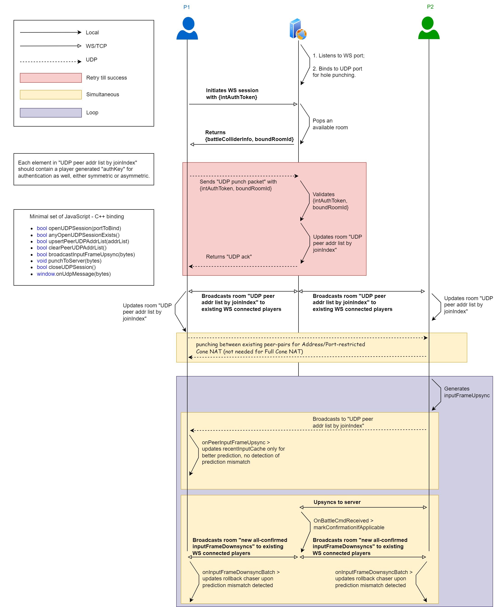

# What to be concerned for internet syncing
1. Server received too late (solution: force confirmation)
2. Client received too late (solution: prediction and frame chasing, big impact on user experience because the graphics will be inconsistent if mismatches occur too often)

# Potential avalanche from `ACTIVE SLOW TICKER`
Under the current "input delay" algorithm, the lag of a single player would cause all the other players to receive outdated commands, e.g. when at a certain moment   
- player#1: renderFrameId = 100, **still active in battle but significantly lagged** due to local CPU overheated
- player#2: renderFrameId = 240
- player#3: renderFrameId = 239
- player#4: renderFrameId = 242

players #2, #3 #4 would receive "outdated(in their subjective feelings) but all-confirmed commands" from then on, thus forced to rollback and chase many frames - the lag due to "large range of frame-chasing" would then further deteriorate the situation - like an avalanche.   

**BE CAUTIOUS, THIS `ACTIVE SLOW TICKER` SITUATION HAPPENS QUITE OFTEN FOR REAL DEVICES** where different operating systems and temporary CPU overheat cause different lags for different player in a same battle! If not properly handled, slow tickers would be `inputing in the "history" of other players`, resulting in too frequent prediction mismatch and thus inconsistent graphics for other players!

In a "no-server & p2p" setup, I couldn't think of a proper way to cope with such edge case. Solely on the frontend we could only mitigate the impact to players #2, #3, #4, e.g. a potential lag due to "large range of frame-chasing" is proactively avoided in `<proj-root>/frontend/assets/scripts/Map.js, function update(dt)`. 

To be fair, **a "p2p" setup can reduce round-trip to single-trip**, but w/o a point of authority in such case player#1 needs a way to recognize the slowness (e.g. check the received peer inputs) and ticks faster for a while to catch up; in contrast in a "server as authority" setup, the server could force confirming an inputFrame without player#1's upsync, and notify player#1 to apply a "roomDownsyncFrame" as well as drop all its outdated local inputFrames. 

# Start up frames
renderFrameId      |   generatedInputFrameId    |  toApplyInputFrameId            
-------------------|----------------------------|----------------------
0, 1, 2, 3         |   0, _EMP_, _EMP_, _EMP_   |  0
4, 5, 6, 7         |   1, _EMP_, _EMP_, _EMP_   |  0
8, 9, 10, 11       |   2, _EMP_, _EMP_, _EMP_   |  1 
12, 13, 14, 15     |   3, _EMP_, _EMP_, _EMP_   |  2

It should be reasonable to assume that inputFrameId=0 is always of all-empty content, because human has no chance of clicking at the very first render frame.  

# Alignment of the current setup 
The following setup is chosen deliberately for some "%4" number coincidence.
- NstDelayFrames = 2 
- InputDelayFrames = 4
- InputScaleFrames = 2  

If "InputDelayFrames" is changed, the impact would be as follows, kindly note that "372%4 == 0".

### pR.InputDelayFrames = 4
renderFrameId             |   toApplyInputFrameId      
--------------------------|---------------------------------------------------- 
368, 369, 370, 371        |   91
372, 373, 374, 375        |   92       

### pR.InputDelayFrames = 5
renderFrameId             |   toApplyInputFrameId      
--------------------------|---------------------------------------------------- 
..., ..., ..., 368        |   90
369, 370, 371, 372        |   91
373, 374, 375, ...        |   92      

# Would using UDP instead of TCP yield better synchronization performance?
Yes, but with non-trivial efforts.

## Neat advantage using UDP 
Let's check an actual use case. As soon as an inputFrame becomes all-confirmed, the server should downsync it to all active players -- and upon reception loss of the packet containing this "all-confirmed downsync inputFrame" to a certain player, the server MUST retransmit another packet containing the same inputFrame to that player. 

To apply UDP on this use case, additional `ack & retransmission mechanism` would be required, which is a moderately difficult task -- don't just pick a 3rd party lib using TCP flow-control alike `sliding window mechanism`, e.g. [RUDP](https://www.geeksforgeeks.org/reliable-user-datagram-protocol-rudp/)! Here's why. 

Assume that the server is downsyncing `sequence of packets[#1, #2, #3, #4, #5, #6, #7, #8, #9, #10]`, when using TCP we get the advantage that each active player is guaranteed to receive that same sequence in the same order -- however in a bad, lossy network when `packet#2` got lost several times for a certain player whose reception window size is just 5, it has to wait for the arrival of `packet#2` at `[_, #3, #4, #5, #6]`, thus unable to process `[#7, #8, #9, #10]` which could contain `unpredictable inputFrame` while `#2` being `correct prediction` for that player.   

That's so neat but still an advantage for using UDP! Yet if the TCP flow-control alike `sliding window mechanism` is employed on UDP, such advantage'd be compromised. 

To summarize, if UDP is used we need 
- an `ack & retransmission mechanism` built on top of it to guarantee reception of critical packets for active players, and 
- reception order is not necessary to be reserved (mimic [markConfirmationIfApplicable](https://github.com/genxium/DelayNoMore/blob/v0.9.14/battle_srv/models/room.go#L1085) to maintain `lastAllConfirmedInputFrameId`), but 
- TCP flow-control alike `sliding window mechanism` should be avoided to gain advantage over TCP. 

## Additional hassles to care about using UDP
When using UDP, it's also necessary to verify authorization of each incoming packet, e.g. by simple time limited symmetric key, due to being connectionless.

## Why not hybrid?
Instead of replacing all use of TCP by UDP, it's more reasonable to keep using TCP for login and the "all-confirmed downsync inputFrames" from server to players (and possibly "upsync inputFrames" from player to server, but tradeoff on that remains to be discussed), while using a `UDP secondary session` for broadcasting inputFrames of each individual player asap (either using p2p or not) just for **better prediction performance**!

## How do you actually implement the `UDP secondary session`?
It's not a global consensus, but in practice many UDP communications are platform specific due to their paired asynchronous I/O choices, e.g. epoll in Linux and kqueue in BSD-ish. Of course there're many 3rd party higher level encapsulated tools for cross-platform use but that introduces extra debugging when things go wrong.

Therefore, the following plan doesn't assume use of any specific 3rd party encapsulation of UDP communication.

# Would using WebRTC for all frontends be a `UDP for all` solution?
Theoretically yes.

## Plan to integrate WebRTC
The actual integration of WebRTC to enable `browser v.s. native app w/ WebRTC` requires detailed planning :)

In my current implementation, there's only 1 backend process and it's responsible for all of the following things. The plan for integrating/migrating each item is written respectively.
- TURN for UDP tunneling/relay
	- Some minor modification to [Room.PlayerSecondaryDownsyncSessionDict](https://github.com/genxium/DelayNoMore/blob/365177a3af6033f1cd629a4a4d59beb4557cc311/battle_srv/models/room.go#L126) should be enough to yield a WebRTC API friendly TURN. It's interesting that [though UDP based in transport layer, a WebRTC session is stateful and more similar to WebSocket in terms of API](https://developer.mozilla.org/en-US/docs/Web/API/WebRTC_API).  
- STUN for UDP holepunching
	- Some minor modification to [Player.UdpAddr](https://github.com/genxium/DelayNoMore/blob/365177a3af6033f1cd629a4a4d59beb4557cc311/battle_srv/models/player.go#L56) should be enough to yield a WebRTC API friendly STUN.  
- reconnection recovery 
	- Not sure whether or not I should separate this feature from STUN and TURN, but if I were to do so, [both `Room.RenderFrameBuffer` and `Room.InputsBuffer`](https://github.com/genxium/DelayNoMore/blob/365177a3af6033f1cd629a4a4d59beb4557cc311/battle_srv/models/room.go) should be moved to a shared fast I/O storage (e.g. using Redis) to achieve the same level of `High Availability` in design as STUN and TURN.   
