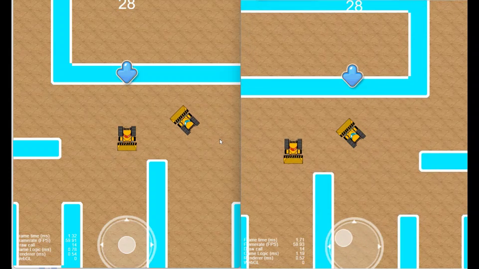
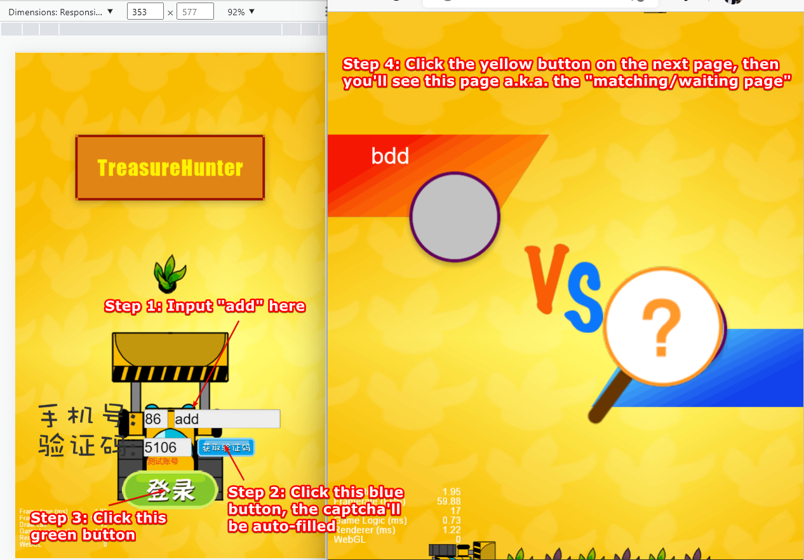

# Preface 

This project is a demo for a websocket-based input synchronization method inspired by [GGPO](https://www.ggpo.net/).   


Please checkout [this demo video](https://pan.baidu.com/s/123LlWcT9X-wbcYybqYnvmA?pwd=qrlw) to see whether the source codes are doing what you expect for synchronization.

The video mainly shows the following features.
- The backend receives inputs from frontend peers and [by a GGPO-alike manner](https://github.com/pond3r/ggpo/blob/master/doc/README.md) broadcasts back for synchronization.
- The game is recovered for a player upon reconnection.
- Both backend(Golang) and frontend(JavaScript) execute collision detection and handle collision contacts by the same algorithm. The backend dynamics can be toggled off by [Room.BackendDynamicsEnabled](https://github.com/genxium/DelayNoMore/blob/v0.5.2/battle_srv/models/room.go#L813), but **when turned off the game couldn't support recovery upon reconnection**.

# 1. Building & running

## 1.1 Tools to install 
### Backend
- [Command Line Tools for Xcode](https://developer.apple.com/download/all/?q=command%20line%20tools) (on OSX) or [TDM-GCC](https://jmeubank.github.io/tdm-gcc/download/) (on Windows) (a `make` executable mandatory)
- [Golang1.19.1](https://golang.org/dl/) (mandatory, in China please try a mirror site like [that of ustc](https://mirrors.ustc.edu.cn/golang/))
- [MySQL 5.7](https://dev.mysql.com/downloads/windows/installer/5.7.html) (mandatory, for OSX not all versions of 5.7 can be found thus 5.7.24 is recommended)
- [Redis 3.0.503 or above](https://redis.io/download/) (mandatory)
- [skeema](https://www.skeema.io/) (optional, only for convenient MySQL schema provisioning)
- [protobuf CLI](https://developers.google.com/protocol-buffers/docs/downloads) (optional, only for development)

### Frontend
- [CocosCreator v2.2.1](https://www.cocos.com/en/cocos-creator-2-2-1-released-with-performance-improvements) (mandatory, **ONLY AVAILABLE on Windows or OSX and should be exactly this version**, DON'T use any other version because CocosCreator is well-known for new versions not being backward incompatible)
- [protojs](https://www.npmjs.com/package/protojs) (optional, only for development)

## 1.2 Provisioning
### Backend/Database
It's strongly recommended that `skeema` is used for provisioning [the required schema](https://github.com/genxium/DelayNoMore/tree/main/database/skeema-repo-root) in MySQL instance. When using `skeema` the steps are as follows.
```
### Mandatory after an initial clone
user@proj-root/database/skeema-repo-root> cp .skeema.template .skeema

### Mandatory
user@proj-root/database/skeema-repo-root> skeema push
```

On `Windows 10/11`, you can compile `skeema` from source and config the host to be `127.0.0.1` instead of `localhost` to use it, i.e. circumventing the pitfall for MySQL unix socket connection on Windows.

### Backend/Golang
```
user@proj-root/battle_srv/configs> cp -r ./configs.template ./configs
```

### Frontend
```
user@proj-root/frontend/assets/plugin_scripts> cp ./conf.js.template ./conf.js
```

## 1.2 Actual building & running
### Backend 
```
### The following command runs mysql-server in foreground, it's almost NEVER run in such a way, please find a proper way to run it for yourself
user@anywhere> mysqld

### The following command runs redis-server in foreground, it's OK to put it in background
user@anywhere> redis-server

### on Windows using TDM-GCC: mingw32-make run-test 
user@proj-root/battle_srv> make run-test
```

### Frontend
The easy way is to try out 2 players with test accounts on a same machine.
- Open CocosCreator v2.2.1 (mandatory, it serves the web content of the following steps)
- Open one browser instance, visit _http://localhost:7456?expectedRoomId=1_, input `add`on the username box and click to request a captcha, this is a test account so a captcha would be returned by the backend and filled automatically (as shown in the figure below), then click and click to proceed to a matching scene.
- Open another browser instance, visit _http://localhost:7456?expectedRoomId=1_, input `bdd`on the username box and click to request a captcha, this is another test account so a captcha would be returned by the backend and filled automatically, then click and click to proceed, when matched a `battle`(but no competition rule yet) would start.
- Try out the onscreen virtual joysticks to move the cars and see if their movements are in-sync.


## 2 Troubleshooting

### 2.1 Redis snapshot writing failure
```
ErrFatal        {"err": "MISCONF Redis is configured to save RDB snapshots, but is currently not able to persist on disk. Commands that may modify the data set are disabled. Please check Redis logs for details about the error."}
```

Just restart your `redis-server` process.
