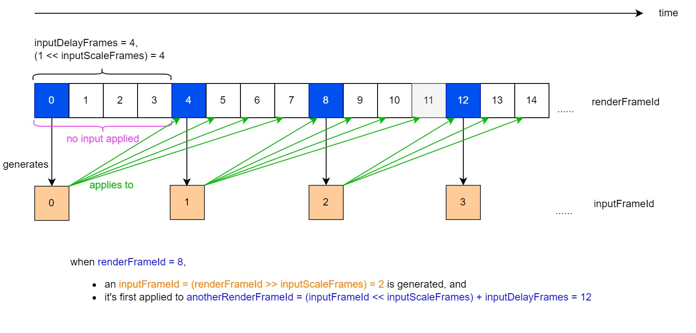
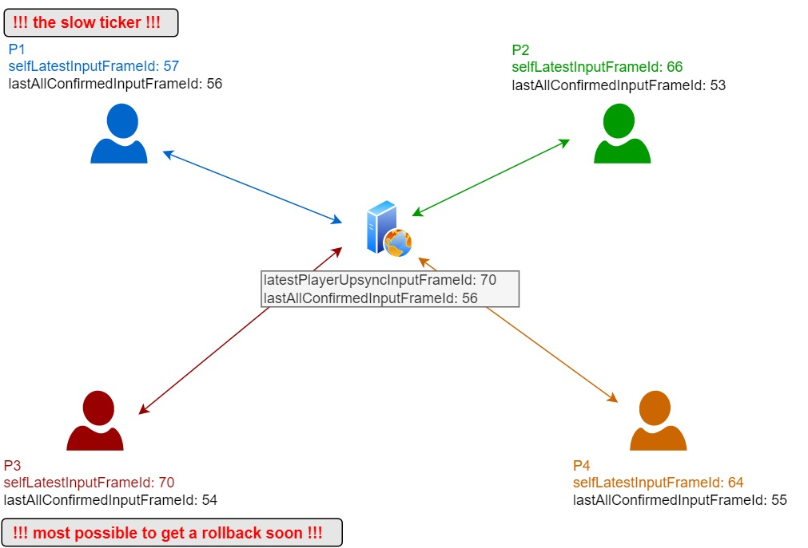
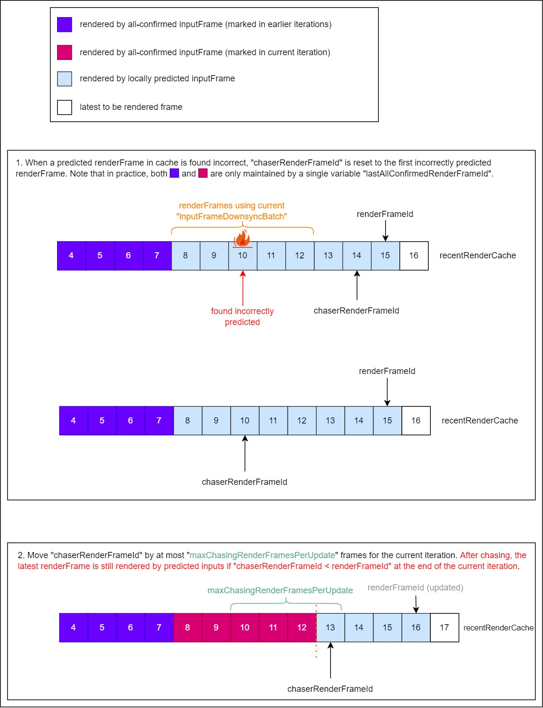
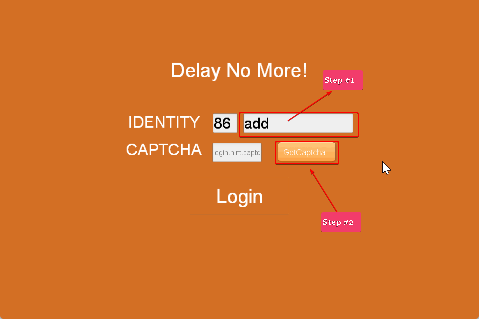
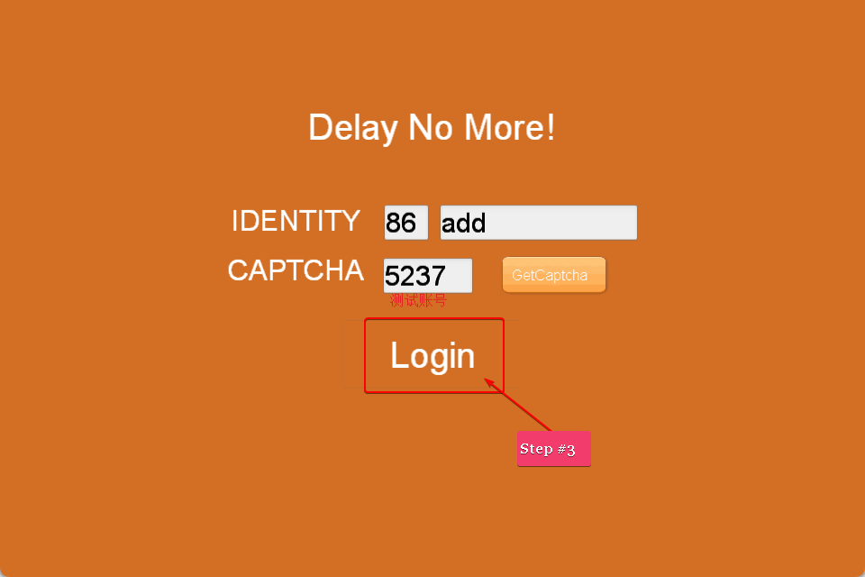
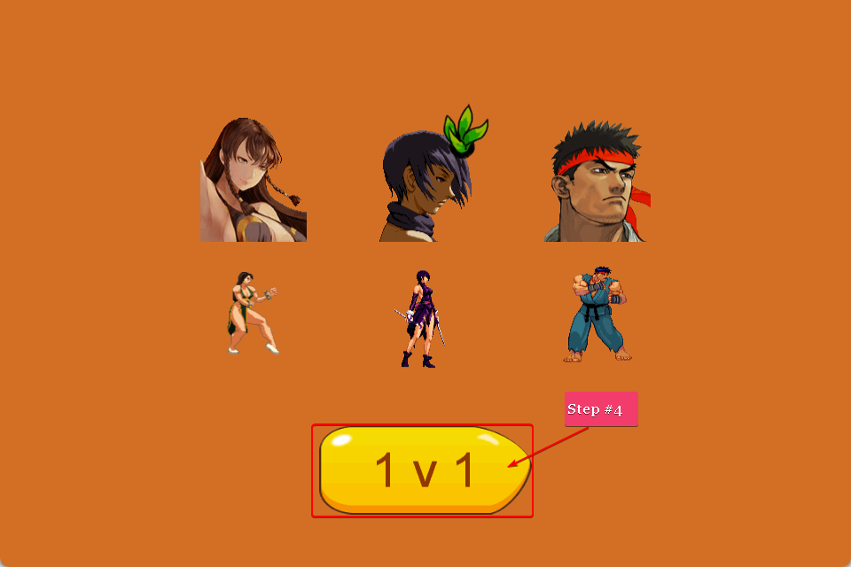
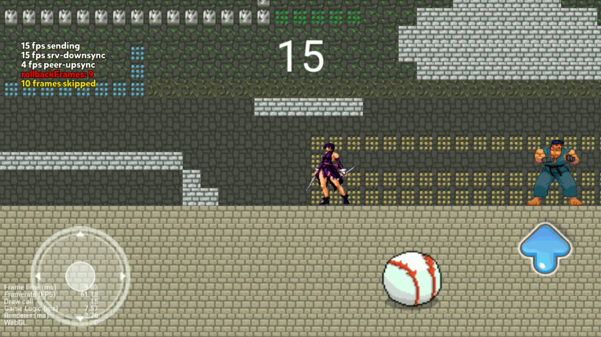
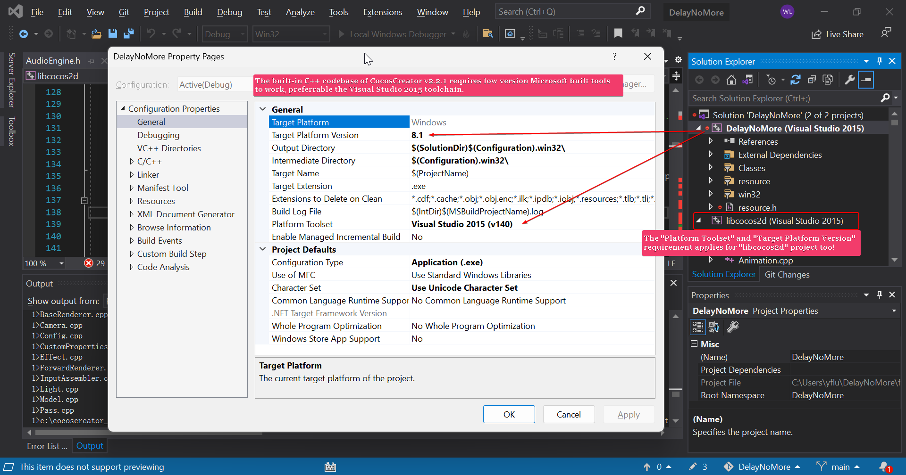
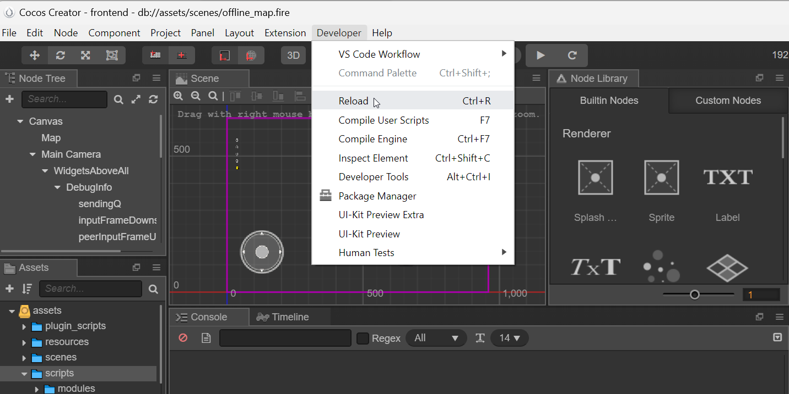
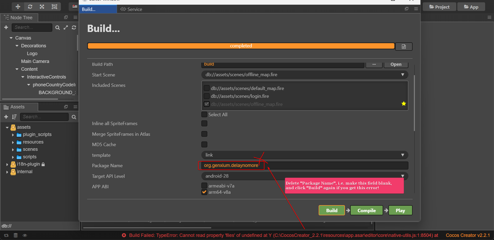

# Preface 

This project is a demo for a websocket-based rollback netcode inspired by [GGPO](https://github.com/pond3r/ggpo/blob/master/doc/README.md). 

[Demo recorded over INTERNET (Phone-Wifi v.s. PC-Wifi UDP holepunched) using an input delay of 6 frames](https://pan.baidu.com/s/1UArwqDShLoPjYppjjqsTqQ?pwd=10wc), and it feels SMOOTH when playing!


(battle between 2 celluar 4G users using Android phones, [original video here](https://pan.baidu.com/s/1m50d-VZxEGT3IgeZtww49g?pwd=eqx1))


**Since v1.0.13, smoothness in worst cases (e.g. turn-around on ground, in air and after dashing) is drastically improved due to update of prediction approach. The gifs and corresponding screenrecordings above are not updated because there's no big difference when network is good -- however, `input delay` is now set to `4 frames` -- while `input delay = 6 frames` was used in the screenrecordings -- and smoothness is even better now (well there's [a new screenrecording for PcWifi vs Android4g here](https://pan.baidu.com/s/1iNrQ2l_wqbWkURMIfyG88w?pwd=fe2f)).** Key changes are listed below.
- [change#1](https://github.com/genxium/DelayNoMore/blob/c582071f4f2e3dd7e83d65562c7c99981252c358/jsexport/battle/battle.go#L647)
- [change#2](https://github.com/genxium/DelayNoMore/blob/c582071f4f2e3dd7e83d65562c7c99981252c358/frontend/assets/scripts/Map.js#L1446)

As lots of feedbacks ask for a discussion on using UDP instead, I tried to summarize my personal opinion about it in [ConcerningEdgeCases](./ConcerningEdgeCases.md) -- **since v0.9.25, the project is actually equipped with UDP capabilities as follows**.
- When using the so called `native apps` on `Android` and `Windows` (I'm working casually hard to support `iOS` next), the frontends will try to use UDP hole-punching w/ the help of backend as a registry. If UDP hole-punching is working, the rollback is often less than `turn-around frames to recover` and thus not noticeable, being much better than using websocket alone. This video shows how the UDP holepunched p2p performs for [Phone-Wifi v.s. PC-Wifi (viewed by PC side)](https://pan.baidu.com/s/1K6704bJKlrSBTVqGcXhajA?pwd=l7ok).
- If UDP hole-punching is not working, e.g. for Symmetric NAT like in 4G/5G cellular network, the frontends will use backend as a UDP tunnel (or relay, whatever you like to call it). This video shows how the UDP tunnel performs for [Phone-4G v.s. PC-Wifi (merged view@v0.9.34, excellent synchronization)](https://pan.baidu.com/s/1yeIrN5TSf6_av_8-N3vdVg?pwd=7tzw). 
- Browser vs `native app` is possible but in that case only websocket is used. For WebRTC integration plan please see [ConcerningEdgeCases](./ConcerningEdgeCases.md). You might also be interested in visiting [netplayjs](https://github.com/rameshvarun/netplayjs) to see how others use WebRTC for browser game synchronization as well.


# Notable Features
- Backend dynamics toggle via [Room.BackendDynamicsEnabled](https://github.com/genxium/DelayNoMore/blob/c582071f4f2e3dd7e83d65562c7c99981252c358/battle_srv/models/room.go#L147)
- Recovery upon reconnection (only if backend dynamics is ON)
- Automatically correction for "slow ticker", especially "active slow ticker" which is well-known to be a headache for input synchronization
- Frame data logging toggle for both frontend & backend, useful for debugging out of sync entities when developing new features

_(how input delay roughly works)_



_(how rollback-and-chase in this project roughly works)_




(By use of [GopherJs](https://github.com/gopherjs/gopherjs), the frontend codes for dynamics are now automatically generated)


# 1. Building & running

## 1.1 Tools to install 
### Backend
- [Command Line Tools for Xcode](https://developer.apple.com/download/all/?q=command%20line%20tools) (on OSX) or [TDM-GCC](https://jmeubank.github.io/tdm-gcc/download/) (on Windows) (a `make` executable mandatory)
- [Golang1.18.6](https://golang.org/dl/) (brought down to 1.18 for _GopherJs_ support, mandatory, in China please try a mirror site like [that of ustc](https://mirrors.ustc.edu.cn/golang/))
- [GopherJs1.18.0-beta1](https://github.com/gopherjs/gopherjs/tree/v1.18.0-beta1) (optional, only for developemnt)
- [MySQL 5.7](https://dev.mysql.com/downloads/windows/installer/5.7.html) (mandatory, for OSX not all versions of 5.7 can be found thus 5.7.24 is recommended)
- [Redis 3.0.503 or above](https://redis.io/download/) (mandatory)
- [skeema](https://www.skeema.io/) (optional, only for convenient MySQL schema provisioning)
- [protobuf CLI](https://developers.google.com/protocol-buffers/docs/downloads) (optional, only for development)

### Frontend
- [CocosCreator v2.2.1](https://www.cocos.com/en/cocos-creator-2-2-1-released-with-performance-improvements) (mandatory, **ONLY AVAILABLE on Windows or OSX and should be exactly this version**, DON'T use any other version because CocosCreator is well-known for new versions not being backward compatible)
- [protojs](https://www.npmjs.com/package/protojs) (optional, only for development)

## 1.2 Provisioning
### Backend/Database
It's strongly recommended that `skeema` is used for provisioning [the required schema](https://github.com/genxium/DelayNoMore/tree/main/database/skeema-repo-root) in MySQL instance. When using `skeema` the steps are as follows.
```
### Mandatory after an initial clone
user@proj-root/database/skeema-repo-root> cp .skeema.template .skeema

### Mandatory
user@proj-root/database/skeema-repo-root> skeema push
```

On `Windows 10/11`, you can compile `skeema` from source and config the host to be `127.0.0.1` instead of `localhost` to use it, i.e. circumventing the pitfall for MySQL unix socket connection on Windows.

### Backend/Golang
```
user@proj-root/battle_srv/configs> cp -r ./configs.template ./configs
```

### Frontend
```
user@proj-root/frontend/assets/plugin_scripts> cp ./conf.js.template ./conf.js
```

## 1.3 Actual building & running
### Backend 
```
### The following command runs mysql-server in foreground, it's almost NEVER run in such a way, please find a proper way to run it for yourself
user@anywhere> mysqld

### The following command runs redis-server in foreground, it's OK to put it in background
user@anywhere> redis-server

### on Windows using TDM-GCC: mingw32-make run-test 
user@proj-root/battle_srv> make run-test
```

### Frontend
The easy way is to try out 2 players with test accounts on a same machine.
- Open CocosCreator v2.2.1 (mandatory, it serves the web content of the following steps)
- Open one browser instance, visit _http://localhost:7456?expectedRoomId=1_, input `add`on the username box and click to request a captcha, this is a test account so a captcha would be returned by the backend and filled automatically (as shown in the figure below), then click and click to proceed to a matching scene.
- Open another browser instance, visit _http://localhost:7456?expectedRoomId=1_, input `bdd`on the username box and click to request a captcha, this is another test account so a captcha would be returned by the backend and filled automatically, then click and click to proceed, when matched a `battle`(but no competition rule yet) would start.
- Try out the onscreen virtual joysticks to move the cars and see if their movements are in-sync.








## 2 Troubleshooting

### 2.1 Redis snapshot writing failure
```
ErrFatal        {"err": "MISCONF Redis is configured to save RDB snapshots, but is currently not able to persist on disk. Commands that may modify the data set are disabled. Please check Redis logs for details about the error."}
```

Just restart your `redis-server` process.

### 2.2 Why not show "PING value" on frontend display? 
The most important reason for not showing "PING value" is simple: in most games the "PING value" is collected by a dedicated kernel thread which doesn't interfere the UI thread or the primary networking thread. As this demo primarily runs on browser by far, I don't have this capability easily.

Moreover, in practice I found that to spot sync anomalies, the following tools are much more useful than the "PING VALUE".  
- Detection of [prediction mismatch on the frontend](https://github.com/genxium/DelayNoMore/blob/c582071f4f2e3dd7e83d65562c7c99981252c358/frontend/assets/scripts/Map.js#L968).
- Detection of [type#1 forceConfirmation on the backend](https://github.com/genxium/DelayNoMore/blob/c582071f4f2e3dd7e83d65562c7c99981252c358/battle_srv/models/room.go#L1315).
- Detection of [type#2 forceConfirmation on the backend](https://github.com/genxium/DelayNoMore/blob/c582071f4f2e3dd7e83d65562c7c99981252c358/battle_srv/models/room.go#L1328).

There's also some useful information displayed on the frontend when `true == Map.showNetworkDoctorInfo`.


### 2.3 WIN32 platform tool versioning

When building for native platforms, it's much more convenient to trigger the CocosCreator project forming frmo CLI, e.g.
```
shell> cd <proj-root>
shell> /path/to/CocosCreator.exe --path ./frontend --build "platform=win32;debug=true"
shell> cd ./frontend/build/jsb-link/frameworks/runtime-src/proj.win32 && MSBUILD DelayNoMore.vcxproj -property:Configuration=Debug
```
or 
```
shell> cd <proj-root>
shell> /path/to/CocosCreator.exe --path ./frontend --build "platform=win32;debug=false"
shell> cd ./frontend/build/jsb-link/frameworks/runtime-src/proj.win32 && MSBUILD DelayNoMore.vcxproj -property:Configuration=Release
```

for release.

If `MSBUILD` command is not yet added to `PATH`, Use `Get-Command MSBUILD` in `Developer Command Prompt for VS 2017/2019` to see where the command should come from and add it to `PATH`.

Similarly for Android release build
```
shell> cd <proj-root>
shell> /path/to/CocosCreator.exe --path ./frontend --build "platform=android;debug=false"
shell> cd ./frontend/build/jsb-link/frameworks/runtime-src/proj.android-studio && ./gradlew assembleRelease
```

### 2.4 CococCreator native build reloading
CocosCreator doesn't have perfect file cache management during native project building, use "Developer Tools > Reload" to reset the IDE status upon mysterious errors.


Another issue is with the package name, see the screenshot below, kindly note that after successfully building with a blank package name, you can then re-fill the desired package name and build again! 


### 2.5 Checking UDP port binding result
__*nix__
``` 
netstat -anp | grep <your_port>
``` 

__Windows__
``` 
netstat -ano | grep <your_port>
``` 

### 2.6 Checking native code crash on non-rooted Android phone 
```
DeveloperOs> adb bugreport ./logs.zip
# The file "logs.zip" will be automatically pulled to current folder of the DeveloperOS, copy "logs/FS/data/tomestones" out of the zip, then use the binary "$NDK_ROOT/ndk-stack" to analyze whichever tombstone you're interested in, for example, I often use the following
DeveloperOs> ${NDK_ROOT}/ndk-stack.cmd -sym \path\to\DelayNoMore\frontend\build\jsb-link\frameworks\runtime-src\proj.android-studio\app\build\intermediates\ndkBuild\debug\obj\local\arm64-v8a -dump \path\to\tombstones\tombstone_03  
# The param "-sym \path\to\objs" tells "ndk-stack" to decode "tombstone_03" with symbols provided by all the files inside that "\path\to\objs".
```
